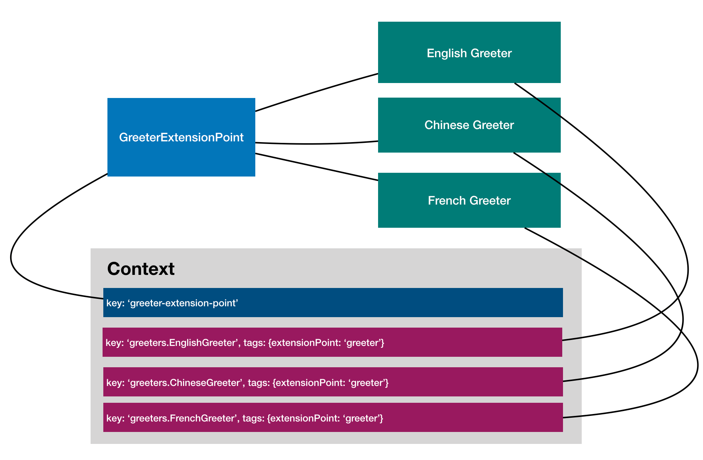

# @loopback/example-greeter-extension

This example project illustrates how to implement the
[Extension Point/extension pattern](https://wiki.eclipse.org/FAQ_What_are_extensions_and_extension_points%3F),
which promotes loose coupling and offers great extensibility. There are many use
cases in LoopBack 4 that fit into design pattern. For example:

- `@loopback/boot` uses `BootStrapper` that delegates to `Booters` to handle
  different types of artifacts
- `@loopback/rest` uses `RequestBodyParser` that finds the corresponding
  `BodyParsers` to parse request body encoded in different media types

## Overview

We'll use the following scenario to walk through important steps to organize the
`greet` service that allows extensible languages - each of them being supported
by a `Greeter` extension.



Various constructs from LoopBack 4, such as `Context`, `@inject.*`, and
`Component` are used to build the service in an extensible fashion.

## Define an extension point

In our scenario, we want to allow other modules to extend or customize how
people are greeted in different languages. To achieve that, we declare the
`greeter` extension point, which declares a contract as a TypeScript interface
that extensions must conform to.

### Define interface for extensions

```ts
/**
 * Typically an extension point defines an interface as the contract for
 * extensions to implement
 */
export interface Greeter {
  language: string;
  greet(name: string): string;
}
```

### Define class for the extension point

```ts
/**
 * An extension point for greeters that can greet in different languages
 */
export class GreeterExtensionPoint {
  constructor(
    /**
     * Inject a getter function to fetch greeters (bindings tagged with
     * 'greeter')
     */
    @inject.getter(bindingTagFilter({extensionPoint: 'greeter'}))
    private greeters: Getter<Greeter[]>,
  ) {}
```

#### Access extensions for a given extension point

To simplify access to extensions for a given extension point, we use dependency
injection to receive a `getter` function that gives us a list of greeters.

#### Implement the delegation logic

Typically, the extension point implementation will get a list of registered
extensions. For example, when a person needs to be greeted in a specific
language, the code iterates through all greeters to find an instance that
matches the language.

## Implement an extension

Modules that want to connect to `greeter` extension point must implement
`Greeter` interface in their extension. The key attribute is that the
`GreeterExtensionPoint` being extended knows nothing about the module that is
connecting to it beyond the scope of that contract. This allows `greeters` built
by different individuals or companies to interact seamlessly, even without their
knowing much about one another.

## Register an extension point

To register an extension point, we simply bind the implementation class to a
`Context`. For example:

```ts
app
  .bind('greeter-extension-point')
  .toClass(GreeterExtensionPoint)
  .inScope(BindingScope.SINGLETON);
```

The process can be automated with a component too:

```ts
import {createBindingFromClass} from '@loopback/context';
import {Component} from '@loopback/core';
import {GreeterExtensionPoint} from './greeter-extension-point';

export class GreeterComponent implements Component {
  bindings = [
    createBindingFromClass(GreeterExtensionPoint, {
      key: 'greeter-extension-point',
    }),
  ];
}
```

## Register extensions

To connect an extension to an extension point, we just have to bind the
extension to the `Context` and tag the binding with
`{extensionPoint: 'greeter'}`.

```ts
app
  .bind('greeters.FrenchGreeter')
  .toClass(FrenchGreeter)
  .apply(asGreeter);
```

Please note `asGreeter` is a binding template function, which is equivalent as
configuring a binding with `{extensionPoint: 'greeter'}` tag and in the
`SINGLETON` scope.

```ts
/**
 * A binding template for greeter extensions
 * @param binding
 */
export const asGreeter: BindingTemplate = binding =>
  binding.inScope(BindingScope.SINGLETON).tag({extensionPoint: 'greeter'});
```

## Configure an extension point

Sometimes it's desirable to make the extension point configurable.

## Configure an extension

Some extensions also support customization.

## Contributions

- [Guidelines](https://github.com/strongloop/loopback-next/blob/master/docs/CONTRIBUTING.md)
- [Join the team](https://github.com/strongloop/loopback-next/issues/110)

## Tests

Run `npm test` from the root folder.

## Contributors

See
[all contributors](https://github.com/strongloop/loopback-next/graphs/contributors).

## License

MIT
